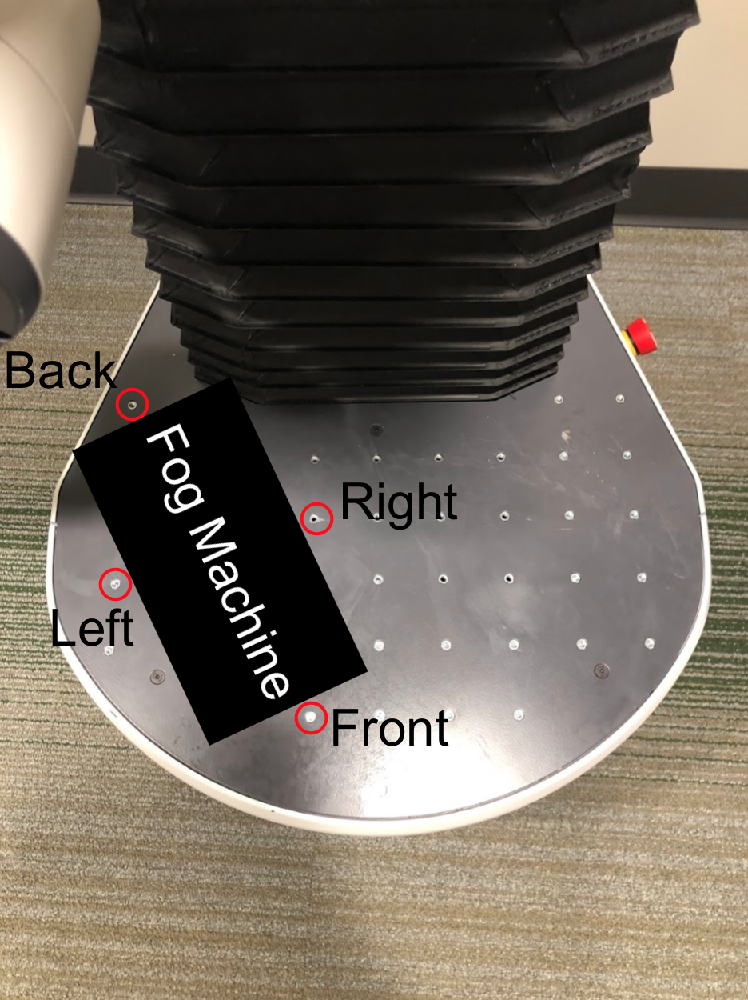

# Fog Machine Bracket Installation Instructions

The files included are the brackets to hold the fog machine in place. There are four brackets, and they are all different dimensions to accommodate for the varying distances between screws on the Fetch robot base. Each bracket has a .stl file for 3D-printing, and a .SLDPRT file to facilitate any editing and improvements that may be needed. 

Similarly to the fog screen shelf, the fog machine should be installed on the lower level of the shelf at the same angle of 19 degrees counterclockwise with respect to the tangent line at the front edge of the Fetch robot base. After placing the fog machine at the same angle, the four brackets should be installed in their respective locations according to the diagram below. The front bracket should be screwed in at the front of the fog machine. The hole to screw the bracket in is indicated by the circle in red. This same process should be repeated for the next 3 brackets. 

